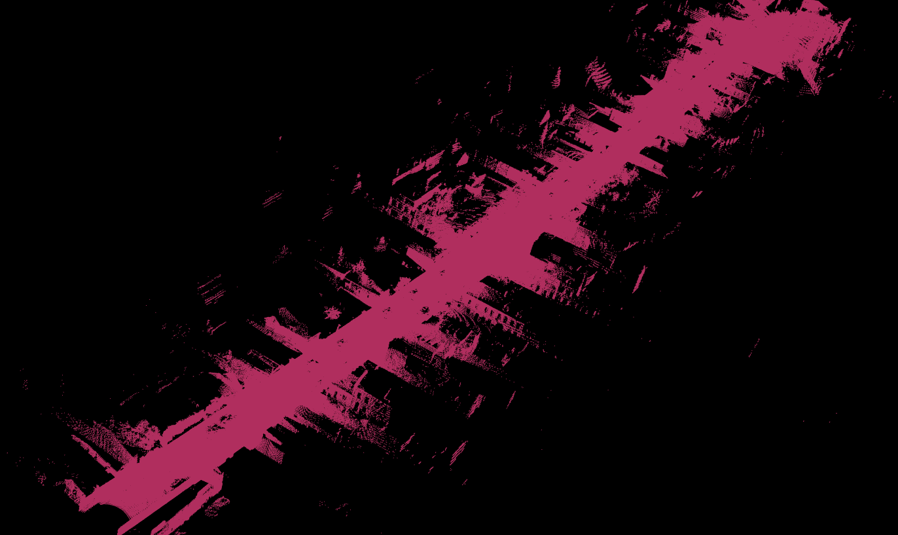

# SPECTRA Dataset: Sensor and  Ground-Truth Toolkit

This dataset is released as part of the [******* Project]().

<p align="center">
  
  <br>
  <em>Figure 1 — The SPECTRA sensor system used for the data aquisition.</em>
</p>


**SPECTRA** is a multimodal dataset designed for autonomous driving research. It features synchronized sensor data collected in real-world driving conditions, enabling research in:

- Perception
- Localization
- Sensor fusion
- Depth estimation


## Sensor Setup

- 📷 **2× Stereo Event Cameras** (Prophesee EVK4)
- 📸 **2× Global Shutter RGB Cameras** (Flir Blackfly S)
- 🌀 **LiDAR** (Ouster32)
- 📍 **RTK GNSS & IMU**
- 🎯 **ATLANS A7 INS** — high-precision ground truth for position and orientation

All sensors are **hardware-synchronized**, including **satellite-based PPS** signals and **external trigger management**.

The sections below are a step-by-step guide to recreate these ground truths from your own ROS bag, using the scripts provided in this repo.

## ROS bag contents
| Topic                                        | Type                              | Description               |
| -------------------------------------------- | --------------------------------- | ------------------------- |
| `/ixblue_ins_driver/ix/ins`                  | `ixblue_ins_msgs/Ins`             | Navigation solution (INS) |
| `/ixblue_ins_driver/standard/imu`            | `sensor_msgs/Imu`                 | IMU (INS unit)            |
| `/ixblue_ins_driver/standard/navsatfix`      | `sensor_msgs/NavSatFix`           | GNSS fix (RTK)            |
| `/ixblue_ins_driver/standard/timereference`  | `sensor_msgs/TimeReference`       | GNSS time reference       |
| `/ouster/imu`                                | `sensor_msgs/Imu`                 | IMU (LiDAR unit)          |
| `/ouster/points`                             | `sensor_msgs/PointCloud2`         | 3D LiDAR point cloud      |
| `/prophesee/camera1_master/cd_events_buffer` | `prophesee_event_msgs/EventArray` | Left event stream         |
| `/prophesee/camera1_master/trigger_event`    | `prophesee_event_msgs/Trigger`    | Left trigger events       |
| `/prophesee/camera2_slave/cd_events_buffer`  | `prophesee_event_msgs/EventArray` | Right event stream        |
| `/stereo/left/image_color`                   | `sensor_msgs/Image`               | Left RGB image            |
| `/stereo/right/image_color`                  | `sensor_msgs/Image`               | Right RGB image           |
| `/synchrobox_msg`                            | `std_msgs/String`                 | Sync box status           |
| `/synchrobox_pin0`                           | `std_msgs/Int64MultiArray`        | Sync box digital pin data |


---
```bash
rosbag info </path/toyourrosbag.bag> 

```

## Step 1 — Extract RGB Frames (Left & Right)

Use the snippet below to extract PNG frames and timestamps from your bag.  
Update only the variables at the top to match your setup.

```bash
# Default usage (topics & fps are fixed inside the script)
python scripts/rosbag/bag_to_video.py data/raw/<your_sequence>.bag

```
The ouput is a video .avi with teh same name of the Rosbag. If you wish to extract teh frames from the videos with no loss 
 you can follow thsi snippet : 

 ```bash
# --- edit these variables ---
VID="data/raw/sequence01.stereo_rgb.avi"   # input stereo video (left|right are side-by-side)
START="00:00:36.000"                       # start timestamp (HH:MM:SS.mmm)
END="00:00:37.000"                         # end timestamp (HH:MM:SS.mmm)  (or use DUR below)
# DUR="1.000"                              # duration in seconds, alternative to END
SIDE="left"                                # left | right
OUT_DIR="data/processed/seq01/frames_left" # output folder
FPS=""                                     # e.g., 30 to decimate; leave empty for all frames
# -----------------------------------------

mkdir -p "$OUT_DIR"

# Choose crop filter based on SIDE
if [ "$SIDE" = "left" ]; then
  CROP="crop=iw/2:ih:0:0"
else
  CROP="crop=iw/2:ih:iw/2:0"
fi

# Optional FPS filter
if [ -n "$FPS" ]; then
  VF="$CROP,fps=$FPS"
else
  VF="$CROP"
fi

# Extract using START..END (accurate seek). For START..DUR, see the alt command below.
ffmpeg -hide_banner -loglevel error \
  -i "$VID" -ss "$START" -to "$END" \
  -vf "$VF" -vsync 0 -frame_pts 1 \
  "$OUT_DIR/${SIDE}_%010d.png"

# --- Alternative: START + duration (fast seek) ---
# ffmpeg -hide_banner -loglevel error \
#   -ss "$START" -i "$VID" -t "${DUR:-1.0}" \
#   -vf "$VF" -vsync 0 -frame_pts 1 \
#   "$OUT_DIR/${SIDE}_%010d.png"


```
<p align="center">
  
  <br>
  <em>Figure — Stereo RGB  preview.</em>
</p>

## Step 2 — Extract Event Frames (Left & Right) & .h5 files

To visualize the events in a video format run this in your bash: 

``` bash
python scripts/rosbag/bag_to_video_event_optimized.py \
  data/raw/sequence01.bag \
  /prophesee/camera1_master/cd_events_buffer \
  /prophesee/camera2_slave/cd_events_buffer \
  data/processed/seq01/previews \
  --fps 30
```
Convert the two Prophesee event topics (and triggers) from a ROS bag into a compressed HDF5 file.

```bash
python scripts/rosbag/2event_to_hdf5.py \
  data/raw/sequence01.bag \
  data/processed/seq01/events.h5
```
To convert each event topic separately into its own compressed HDF5 file:

```bash
python3 scripts/rosbag/event_topic_to_h5.py /prophesee/camera1_master/cd_events_buffer data/raw/sequence01.bag data/processed/seq01.left.h5
python3 scripts/rosbag/event_topic_to_h5.py /prophesee/camera2_slave/cd_events_buffer data/raw/sequence01.bag data/processed/seq01.right.h5
```
Extract trigger timestamps into a text file
```bash
python3 scripts/rosbag/extract_timestamp.py data/raw/sequence01.bag
```

<p align="center">
  
  <br>
  <em>Figure — Stereo Event preview.</em>
</p>

## Step 3 — Extract the Lidar pointcloud .pcd and the trajectory .txt with FasterLIo
We used **Faster-LIO** ([GitHub link](https://github.com/gaoxiang12/faster-lio)). The code has been copied into `src/faster-lio`. You can either follow their GitHub instructions for installation or simply copy this folder into a catkin workspace and build it.  

To generate the `.pcd` and `.txt` files, first play the ROS bag in one terminal:

```bash
rosbag play data/raw/sequence01.bag
```
Then, in another terminal, launch Faster-LIO:
```bash
roslaunch faster_lio mapping_ouster32.launch
```
The output files will be saved in faster-lio/results, and tehre will be a .txt file for the trajectory coordinates and a scan.pcd for the Lidar Poincloud


The Pointcloud can be visualized as follow: 

```bash
pcl_viewer scans.pcd 

```
<p align="center">
  
  <br>
  <em>Figure 1 — The sequence day_suburbs_01  Lidar poincloud.</em>
</p>

## Step 4 — Depth Maps extraction from the lidar poincloud on the left event camera frame

```bash
python scripts/depth_map/depth_map_projection.py
```

 It projects a global LiDAR point cloud onto time-aligned RGB frames using IMU poses, so you can visually fine-tune the IMU→Camera extrinsics (small rotations/translations) and instantly see the effect. Points are depth-colored and overlaid on the nearest image in time with also a control over the calibration rotation and translation to tweak the calibration values if the calibration is not as accurate as it shoould be. 

At the top of teh script you should mention the paths to: 

`imu_file_path`, `pcd_file_path`, `rgb_image_dir`

Camera intrinsics `K` and image size `image_width`, `image_height`

Initial IMU→Camera matrix `T_imu_to_camera_init`

Search radius for map points (default 75 m)

<p align="center">
  
  <br>
  <em>Figure 5 — LiDAR Reprojection on the left event camera frame .</em>
</p>


## Step 5 — Semantic Segmentation

IN our SPECTRA Dataset, we consider semantic segmentation as a double usage annotation, that can be used to train models on **semantic segmentation using event data**, but it is also used to generate **pseudo ground truths** for learning-models in depth estimation, bu creating dense depth maps and label-aware diffusion of Lidar data. 

We implemented a version of **[DeepLabV3+ checkpoint (Google Drive)](https://drive.google.com/file/d/1La2oCvuufKtBQ4Ot_Xsl04wbIiocabLb/view?usp=sharing)** trained and finetuned on the CityScapes Dataset. 


To run semantic segmentation on a set of images and save the results:

```bash
python src/save_segmentation.py
```
<p align="center">
  
  <br>
  <em>Figure 5 — SEmantic Segmentation Masks .</em>
</p>

## Step 6  Depth Map Densification using Semantic Segmentation


The system uses a **semantic-aware pipeline** that combines:
- **Occlusion filtering**: Removes outlier depth points using dual-zone processing (near/far objects)
- **Semantic-guided KNN filling**: Fills missing depth values within semantic classes (vehicles, roads, buildings, etc.)
- **Segmentation-guided smoothing**: Applies smoothing while preserving object boundaries


```bash
python depth_map_densification.py

```
Required files in the same directory
project_directory/

```
├── seg_map/seg_map_68.png      # Semantic segmentation (RGB)
├── res/depth_map_68.png        # Colored depth image (inferno colormap)
├── res_npy/depth_map_68.npy    # Raw depth data (numpy array)
└── images1/68.png              # Original RGB image

 ```


<p align="center">
  
  <br>
  <em>Figure 7 — Densified Depth Maps .</em>
</p>

# License
This project is licensed under **Creative Commons Attribution 4.0 International (CC BY 4.0)**.  
See [`LICENSE`](./LICENSE) and the official terms: https://creativecommons.org/licenses/by/4.0/

**Note (future):** Some parts of this repository may be relicensed as **Research Usage Only (RUO)**.  
When/if that happens, affected files/folders will be clearly marked (`License: RUO`) and a separate [`LICENSE-RUO`](./LICENSE-RUO) will be added.


# Acknowledgement 

This work was supported by the **anonymous** project, funded by the **Anonymous** (anonymes).

We gratefully acknowledge the ***** high-performance computing center for compute time, storage, and technical assistance.

Our thanks also go to all colleagues and students who contributed to the hardware design and integration, calibration and software tooling, and the many hours of field data acquisition that made this dataset possible.

Finally, this project builds on a broad body of prior work. We will list the key papers and datasets that informed our pipeline and benchmarks here :


- [Event-based Vision Resources (UZH RPG)](https://github.com/uzh-rpg/event-based_vision_resources) — curated papers, datasets, and code.

**Datasets**
- [DSEC — Stereo Event Camera Dataset](https://dsec.ifi.uzh.ch/) • [Code](https://github.com/uzh-rpg/DSEC)
- [MVSEC — Multi Vehicle Stereo Event Camera Dataset](https://daniilidis-group.github.io/mvsec/)

**Semantic segmentation**
- [DeepLabv3 — Rethinking Atrous Convolution](https://arxiv.org/abs/1706.05587)
- [DeepLabv3+ — Encoder–Decoder with Atrous Separable Convolution](https://arxiv.org/abs/1802.02611)
- [TensorFlow DeepLab (research)](https://github.com/tensorflow/models/tree/master/research/deeplab)
- [DeepLab2 (Google Research)](https://github.com/google-research/deeplab2)

**Object detection**
- [YOLOv10 — Real-Time End-to-End Object Detection](https://arxiv.org/abs/2405.14458) • [Code](https://github.com/THU-MIG/yolov10)
